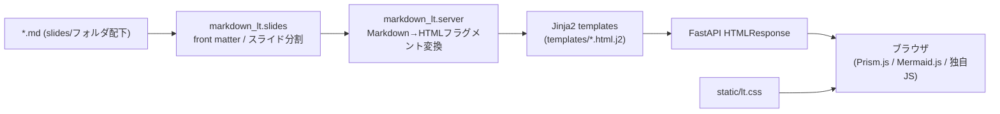
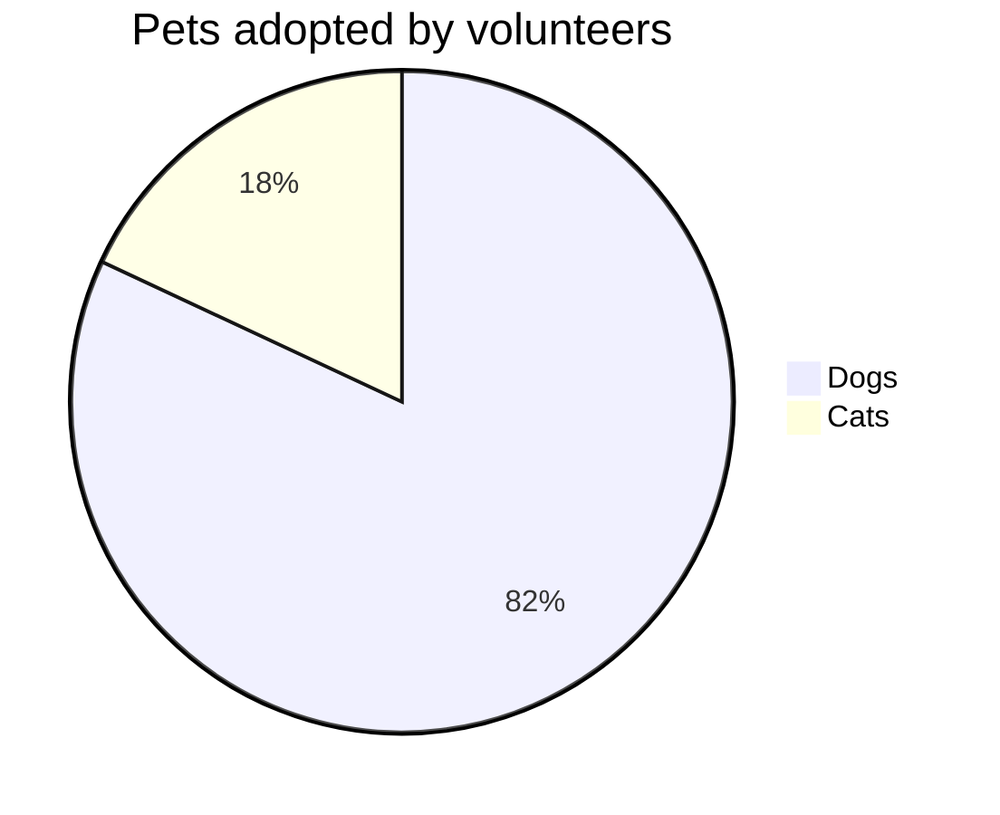

# markdown-lt 設計・使い方ドキュメント

Markdown ファイルをそのままプレゼンテーション（LT: Lightning Talk）スライドとして
ブラウザで表示する FastAPI ベースのアプリの設計と使い方をまとめたドキュメント。

READMEより詳しい内容（アーキテクチャ、Markdown記法、CSS実装の注意点など）を
ここに集約する。

---

## 1. 全体像



- **サーバー**: FastAPI (`markdown_lt.server`) が `.md` を読み込み、HTML文字列を組み立てて返すだけ。SPA的なクライアント側ルーティングはなく、1リクエスト=1完全HTMLページ。
- **スライド送り**: 全スライドを1枚のHTMLに埋め込み、JSで `.active` クラスを付け替えて表示を切り替える（ページ遷移なし、`prefers-reduced-motion` 非対応の transform アニメーション付き）。
- **シンタックスハイライト/図表**: PrismJS・Mermaid.js は CDN 経由で読み込み、ページロード時に `Prism.highlightAll()` / `mermaid.initialize()` を実行するクライアントサイド処理。

---

## 2. ディレクトリ構成

```
markdown-lt/
├── pyproject.toml          # 依存関係・CLIエントリポイント (mdlt / lt / markdown-lt)
├── src/markdown_lt/
│   ├── cli.py               # `lt` コマンドの実体。ポート自動採番・uvicorn起動
│   ├── server.py            # FastAPIアプリ本体。Markdown→HTML変換ロジックの大部分
│   ├── slides.py            # front matter抽出・見出しでのスライド分割 (+ 未使用のrender_html)
│   └── themes.py            # テーマ(color token)定義
├── templates/
│   ├── slide_deck.html.j2   # デッキ全体のHTML殻（head/nav/JS一式）
│   ├── slide_shell.html.j2  # 1スライド分のheader/body/footer構造
│   ├── title_slide.html.j2  # 先頭 `# タイトル` 用の専用レイアウト
│   └── deck_index.html.j2   # `/` でのデッキ一覧ページ
├── static/lt.css             # 全スタイル(テーマ変数・レイアウト・シンタックスハイライト調整)
├── slides/<folder>/*.md      # スライド本体（フォルダ単位でデッキを管理）
└── tests/test_slides.py      # slides.py / server.py の単体テスト
```

---

## 3. 実行方法

```bash
# 依存関係インストール（devエクストラ込み）
uv sync --extra dev

# テスト
uv run pytest -q

# デフォルトの slides/ ディレクトリを配信
uv run lt
# もしくは
uv run python -m markdown_lt.server

# ポート/ホスト/テーマを指定
uv run lt --host 127.0.0.1 --port 8002 --theme light

# --reload 付きで直接uvicornを叩く場合
uv run python -m uvicorn markdown_lt.server:app --reload --port 8000
```

- `lt` / `mdlt` / `markdown-lt` はすべて同じ `markdown_lt.cli:main` を指す（`pyproject.toml` の `[project.scripts]`）。
- `cli.py` の `get_available_port()` が指定ポート使用中なら自動で次の空きポートにフォールバックする。
- `create_app(source, theme_name)` に単一の `.md` パスを渡すと、そのファイル単体をトップページとして配信する（`/slides/{folder}` を使わないシングルデッキモード）。

### ルーティング（`server.py::create_app`）

| パス | 内容 |
|---|---|
| `GET /` | `source` がファイルならそのデッキを表示。ディレクトリなら `slides/` 配下のフォルダ一覧ページ（`deck_index.html.j2`） |
| `GET /slides/{folder_name}` | `slides/{folder_name}/` 内の Markdown を1デッキとして表示 |
| `GET /{folder_name}` | 上記の短縮エイリアス |
| `GET /static/*` | `static/` ディレクトリを `StaticFiles` でそのまま配信 |

`resolve_slide_file_for_folder()` はフォルダ内から `index.md → deck.md → slide.md → sample-slide.md → README.md` の優先順で探し、無ければ最初に見つかった `*.md`／`*.text` を採用する。

---

## 4. Markdown 記法リファレンス

### 4.1 フロントマター

```markdown
---
title: "サンプルスライド"
subtitle: これはサブタイトルです
date: "2026-08-27"
author: "Tatsuki-I"
---
```

`parse_front_matter()` が `key: value` 形式（クォート可）を単純パースする。YAMLの入れ子・配列は文字列としてしか扱えない簡易実装。

### 4.2 スライド分割

- 本文中の最初の `# 見出し` はタイトルスライド（`title_slide.html.j2`）になる。author/date がフロントマターにあれば自動で meta 行を追加。
- それ以降は **`## 見出し` ごとに1スライド**（`split_slides()`）。
- `## ` の直後の行がスライドヘッダー（`<h2>`）、それ以降がスライド本文。

### 4.3 段組みレイアウト（列分割）

スライド本文中に `### Left` / `### Center`（`Centre` も可）/ `### Right` /
`### Right Top` / `### Right Bottom` / `### Center Top` / `### Center Bottom`
という H3 見出しを置くと、その配下のブロックが列として振り分けられる。

| 組み合わせ | 生成されるHTML | CSSクラス |
|---|---|---|
| Left + Right | 2カラム | `.two-col` |
| Left + Center + Right | 3カラム | `.three-col` |
| Left + Right Top + Right Bottom | 左1列＋右2段 | `.left-right-vertical` + `.right-stack` |
| Left + Center Top + Center Bottom + Right | 中央のみ2段の3カラム | `.three-col` + `.center-stack` |

各列（`.left-column` / `.center-column` / `.right-column` / `.top-column` / `.bottom-column`）は
**クリックで拡大/縮小できるインタラクティブ要素**（`slide_deck.html.j2` 内のJS）。
クリックすると `is-left-expanded` 等のクラスが親コンテナに付与され、CSS transition で他列を縮小・フェードさせる。

### 4.4 注釈ボックス（`:::note`）

```markdown
:::note info
インフォメーション本文
:::
```

- 種別: `info` / `warn` / `alert`（省略時は `info`）
- スライド末尾に置かれた `:::note` ブロックと引用（`>`）ブロックは自動的に
  **フッター領域**（`slide-footer`）へ抽出される（`render_slide_html()` の正規表現処理）。

### 4.5 コードブロック

```markdown
​```python
import hoge

def main():
    print("hello")
​```
```

- `fenced_code` 拡張で `<pre><code class="language-python">` に変換後、
  サーバー側の正規表現で `<pre class="line-numbers">` を付与し、PrismJS の
  line-numbers プラグイン対象にしている。
- 実際のシンタックスハイライトは **クライアント側の `Prism.highlightAll()`** が行う
  （サーバーは `codehilite` 拡張を主要パスでは使っていない。`:::note` 内の
  Markdown だけ `codehilite` 拡張付きでレンダリングされる非対称な実装なので注意）。
- ⚠️ 詳しくは [6. CSS実装の注意点（Prismとの詳細度戦争）](#6-css実装の注意点prismとの詳細度戦争) を参照。

### 4.6 Mermaid 図

````markdown

````

`<pre class="mermaid">...</pre>` に変換され、クライアント側で `mermaid.initialize()` が描画する。

### 4.7 その他のインライン記法

| 記法 | 変換後 | 用途 |
|---|---|---|
| `{漢字\|かんじ}` | `<ruby>漢字<rt>かんじ</rt></ruby>` | ルビ |
| `~~text~~` | `<del>text</del>` | 打ち消し線（標準のMarkdown拡張ではなく独自正規表現） |
| `> 引用` | 通常の `<blockquote>` | スライド末尾ならフッターへ自動移動 |

---

## 5. クライアント側の挙動（`templates/slide_deck.html.j2`）

- **スライド送り**: 全 `.slide` をDOMに並べて `.active` の付け替えのみで切り替え（history/URLは変化しない）。
- **キーボード操作**: `→` / `Enter` / `PageDown` で次へ、`←` / `Backspace` / `PageUp` で前へ。
- **列の展開/縮小**: 各列に `tabindex`, `role="button"` を付与し、クリック/Enter/Spaceで
  `is-*-expanded` をトグル。展開時は `overflow: visible` にして他スライドへ影響しないよう
  `syncExpandedOverflow()` で個別制御。
- **ズームボタン（虫眼鏡アイコン）**: `slide_deck.html.j2` にマークアップのみ存在し、
  **現状JSハンドラは未実装**（クリックしても何も起きない）。将来の拡張ポイント。
- **カウントダウンタイマー**: `slide_deck.html.j2` 上で 5 分 / 3 分切替、開始ボタン、警告色、シークバー連動、
  画面全体の警告演出を持つ。`requestAnimationFrame` で1秒単位に近い流れで進行し、残り時間が閾値を下回ると
  `timer-warning` と `timer-alert-active` の状態が切り替わる。
- **CDN依存**: `mermaid@10`, `prismjs@1.29.0`（core + autoloader + line-numbers プラグイン）,
  Prismテーマ `prism-tomorrow` をすべて `cdn.jsdelivr.net` から読み込む。オフライン環境では
  シンタックスハイライトとMermaid描画が動作しない。

---

## 6. CSS実装の注意点（Prismとの詳細度戦争）

このプロジェクトで最もハマりやすいポイント。**`static/lt.css` のコードブロック関連ルールを
編集する際は必ず読むこと。**

### 何が起きるか

`templates/slide_deck.html.j2` の `<head>` は次の順でCSSを読み込む。

```html
<link rel="stylesheet" href="https://cdn.jsdelivr.net/npm/prismjs@1.29.0/themes/prism-tomorrow.min.css" />
<link rel="stylesheet" href="https://cdn.jsdelivr.net/npm/prismjs@1.29.0/plugins/line-numbers/prism-line-numbers.min.css" />
<link rel="stylesheet" href="/static/lt.css" />
```

`lt.css` は最後に読まれるので、素朴には「後勝ち」で `lt.css` の `pre`/`code` の
指定が勝つはずに見える。しかし Prism 側のCSSは

```css
code[class*=language-], pre[class*=language-] { font-size: 1em; line-height: 1.5; }
pre[class*=language-].line-numbers { padding-left: 3.8em; }
```

のように **属性セレクタ** (`[class*="language-"]`) を使っており、CSS詳細度が
単純な `pre` / `code` セレクタより高い。詳細度は「後勝ち」より優先されるため、
`lt.css` 側で `pre { font-size: 0.74rem }` のように書いても実際には**負けて無視される**。

さらにもう1つ罠がある。サーバーが生成する生HTMLでは `<pre class="line-numbers">`
（`language-*` クラスなし）だが、**`Prism.highlightAll()` がクライアント側で
実行された瞬間、`<code>` の `language-*` クラスを親の `<pre>` にもコピーする**。
そのため:

- 静的HTML（`curl` などで見える範囲）: `pre` に `language-*` は付いていない
- 実際にブラウザで描画された後のDOM: `pre` にも `language-*` が付与されている

これにより「サーバーのCSSファイルは正しく更新されているのに、ブラウザで見ると
反映されていないように見える」という混乱が起きやすい。**キャッシュを疑う前に、
まずこの詳細度問題を疑うこと。**

### 対処方針（`lt.css` で実際に採用している書き方）

Prismのセレクタと同等以上の詳細度になるよう、こちらも `[class*="language-"]` を
含めたセレクタを明示的に用意し、かつ `lt.css` が後に読み込まれることを利用して勝つ。

```css
pre,
pre[class*="language-"] {
  /* pre自体のfont-size/line-height/padding/marginをここで確定させる */
}

pre.line-numbers,
pre[class*="language-"].line-numbers {
  /* line-numbers用のpadding-leftも同様に上書き */
}

pre code[class*="language-"],
code[class*="language-"] {
  /* code要素のfont-size/line-height */
}
```

### 検証方法

見た目のスクリーンショットだけで判断せず、**実ブラウザの computed style を直接
取得して確認する**のが最も確実（このプロジェクトでの実績あり）。

```js
// ブラウザ側で実行し、pre/code/line-numbers-rows の実際の計算値を突き合わせる
const pre = document.querySelector('pre.line-numbers');
const code = pre.querySelector('code');
const rows = pre.querySelector('.line-numbers-rows');
[pre, code, rows].forEach((el) => {
  const s = getComputedStyle(el);
  console.log(el.className, s.fontSize, s.lineHeight, s.padding, s.margin);
});
```

三者の `font-size` / `line-height` が一致していないと、行番号ガター (`.line-numbers-rows`)
と実際のコード行がズレて表示される（1行ズレる/なくなる、といった見た目になる）。

### その他のCSS上の注意点

- `pre` にはブラウザ標準の UA stylesheet マージンが残っていたため、`margin: 0` を
  明示していないと `padding-bottom` を詰めても余白が消えない（コードブロック下の
  余白トラブルの実例）。
- `.left-column` 等（`.two-col` / `.three-col` / `.left-right-vertical` の子要素）は
  `display: grid; align-items: stretch;` の影響で **中身が短くても列の高さいっぱいに
  引き伸ばされる**。コードブロック自体の padding は正しくても、列コンテナのほうが
  余白のように見えることがあるため、「余白が広い」系の不具合調査では
  `pre` 単体だけでなく親の `.left-column` 等のサイズも確認すること。

---

## 7. テーマ（`themes.py`）

| テーマ名 | background | text | accent |
|---|---|---|---|
| `default` | `#0f172a` | `#e2e8f0` | `#38bdf8` |
| `light` | `#f8fafc` | `#0f172a` | `#2563eb` |
| `solarized` | `#002b36` | `#fdf6e3` | `#b58900` |

`get_theme(name)` は未知の名前なら `default` にフォールバックする。CSS変数
(`--bg`, `--text`, `--accent`, `--muted`) として `slide_deck.html.j2` の `<style>` に
埋め込まれる。

---

## 8. テスト（`tests/test_slides.py`）

`pytest` + `fastapi.testclient.TestClient` ベース。主なカバレッジ:

- フロントマター付きMarkdownがタイトルスライド＋H2ごとのスライドに分割されること
- テーマのトークンが期待通りであること
- `### Left` / `### Right` の2カラム、`### Right Top/Bottom` の縦2段、
  `### Centre Top/Bottom` の中央縦2段など、レイアウトパターンごとのHTML出力

```bash
uv run pytest -q tests/test_slides.py
```

---

## 9. 既知の未実装・注意点まとめ

- ズームボタン（フォントサイズ変更UI）はマークアップのみでJS未実装。
- カウントダウンタイマーは実装済み。デフォルト 5 分、3 分切替あり、2 枚目移動時の自動開始と警告演出を含む。
- `slides.py::render_html()` は定義されているが `server.py` からは呼ばれていない
  デッドコード（実際のレンダリングパスは `server.py::build_slide_html` +
  `templates/slide_deck.html.j2`）。
- コードブロックのハイライトは **PrismJS（クライアント側）** が担当し、
  `codehilite`（サーバー側のPython Markdown拡張）は `:::note` 内のMarkdownにしか
  使われていない。両者は別物なので、ハイライト色を変えたい場合は
  Prismのテーマ（CDN経由）を差し替える必要がある。
- README.md（トップレベル）は簡潔な概要のみを保持し、詳細はこのファイルに集約する方針。

---

## 10. 将来の拡張候補（README由来）

- 右/左レイアウトのさらなる柔軟化
- ノート表示と発表者モード
- PDF / PNG エクスポート
- カスタムテーマの追加
- ズームボタン／カウントダウンタイマーの実装
- ローカルファイル変更を検知したライブリロード（`watchfiles` は依存関係に入っているが未配線）
