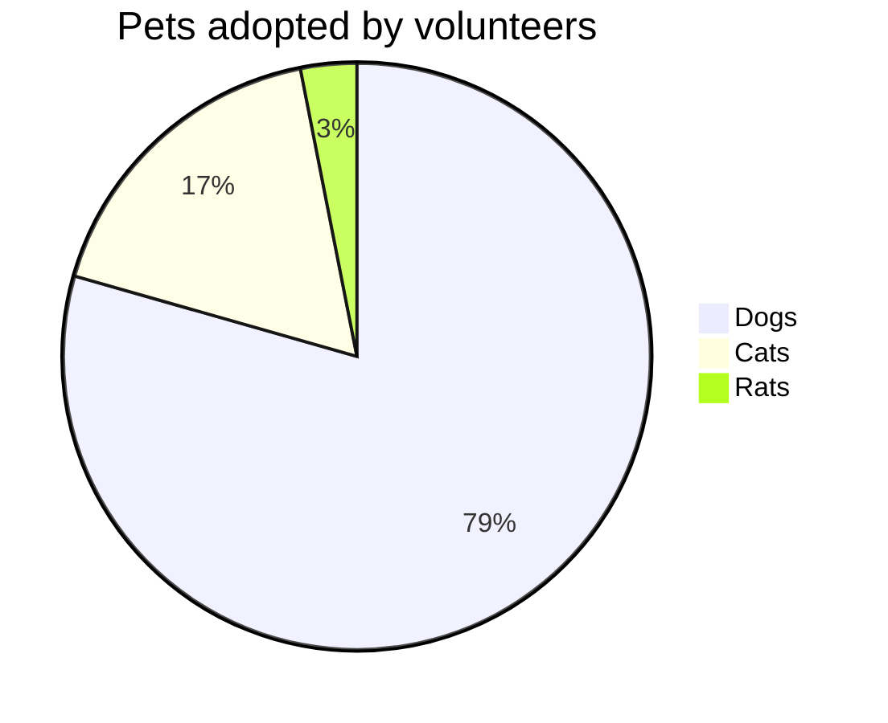
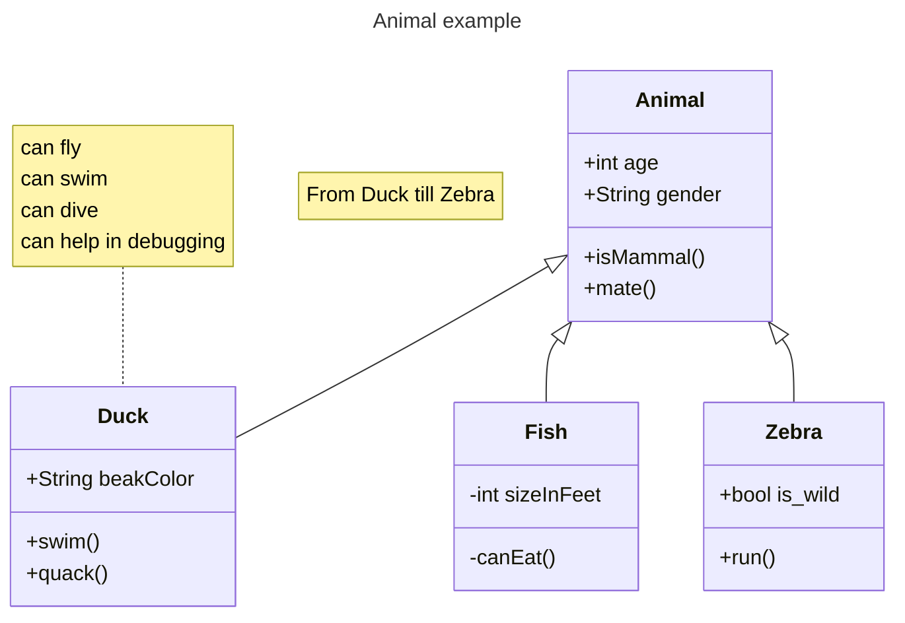

## アジェンダ

- foo
- bar

## foo

- なんか
- 箇条書きで
  - 書けます

> 参考文献: [参考にしたサイト](https://example.com)

## bar

{寿限無|じゅげむ}、{寿限無|じゅげむ} {五劫|ごこう}の{擦|す}り{切|き}れ 海砂利水魚の水行末 雲来末 風来末 食う寝る処に住む処 藪ら柑子の藪柑子 パイポパイポ パイポのシューリンガン シューリンガンのグーリンダイ グーリンダイのポンポコピーのポンポコナーの長久命の長助

:::note info
インフォメーション
infoは省略可能です。
:::

## hoge

### Left

1. 数字の
1. 箇条書きも
  1. 色々
  1. 書いたり
1. できます

### Right

左右分割もできますよ。画像も埋め込めます。


:::note warn
警告

○○に注意してください。
:::

## fuga

### Left

３分割も可能です。

**太字** もできます。

_イタリック_ もできます。

~~打ち消し線~~ もできます。

### Centre

```python
import hoge

def main():
  print("hello")
```

### Right



:::note alert
より強い警告
○○しないでください。
:::

## piyo

### Left

- 上下にも分割できますよ

### Right Top

```Python
import hoge

def main():
  print("hello")
```

### Right Bottom


